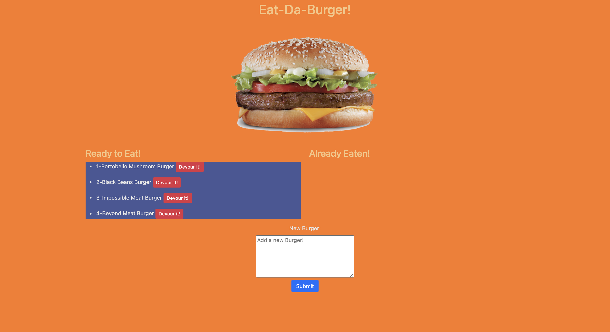

# Eat-Da-Burger!

  ## Table of Contents
  1. [Description](#description "Description")
  2. [Installation](#installation "Installation")
  3. [Usage](#usage "Usage")
  4. [License](#license "License")
  5. [Contribution](#contribution "Contributing")
  6. [Tests](#tests "Tests")
  7. [Questions](#questions "Questions")

  ## Description
  

  A full-stack app that allows users to save burgers into a data base. Then they can choose to eat them, which moves the burgers to the 'Eaten' side of the page. This app uses node.js, express, express-handlebars and  mysql.

  

  ## Installation
  Run "npm install" in the terminal, insidethe app directory.

  ## Usage
  This app works as a full-stack application, having full interaction between the front-end and back-end.

  ## License
  For more information on the license for this project, please click on the following link:
  [License](https://opensource.org/licenses/Apache-2.0)

  ## Contribution
  This project is an assigment for the UM Coding Bootcamp. The instructions for setting it up were provided by the staff of the bootcamp. The whole app was developed by Luis Rujana.

  ## Tests
  NA

  ## Questions
  If you have any questions regarding this application or want to check my other projects, please contact me at:
  [Portfolio](https://lmrujana.github.io/responsive_portfolio/portfolio.html)  
  [GitHub Page](https://github.com/lmrujana)  
  Email: lmrujanass@gmail.com
